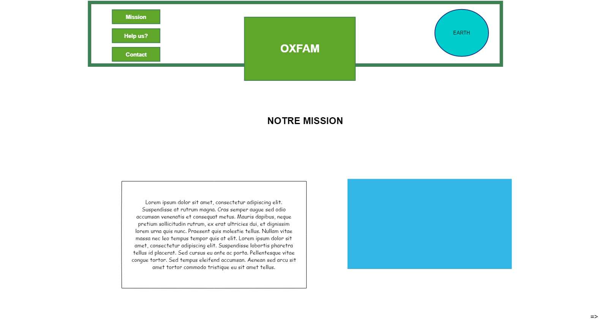
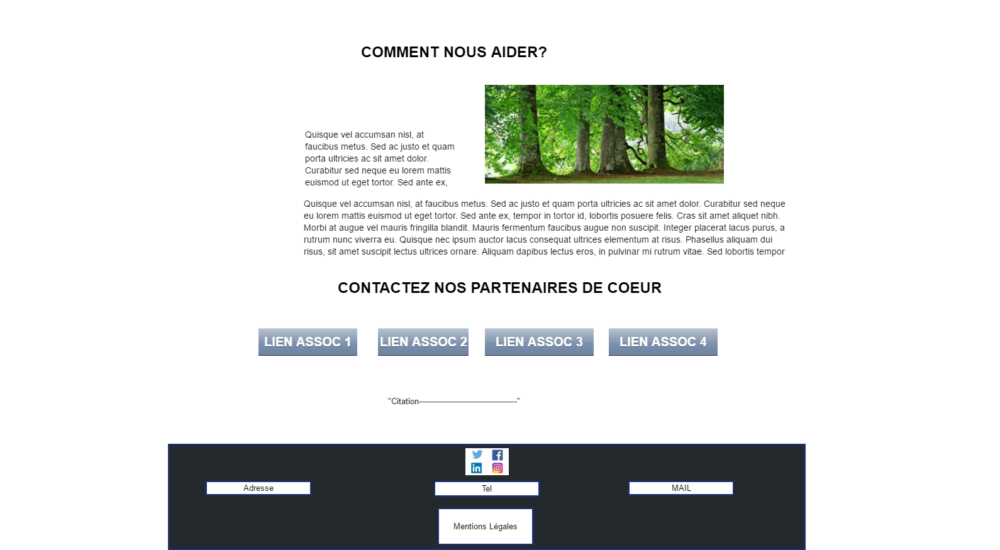

# 3-exercice-html-basic.md

* Voir les consignes [ici:](https://github.com/becodeorg/lovelace-2/blob/master/01-La-prairie/html-css/3-exercice-html-basic.md)
* Résultat de l'exercice [ici:](https://makemyA.github.io/Learning-Environment/3-exercice-html-basic.md/)

***
## Etape1- Réalisation du mockup

Pour se faire j'ai utilisé le logiciel Pencil Evolus. Voici le résultat ci-dessous!

***

***

## Etape2- Intégration en html/Css

Pour réaliser cet exercice, j'ai utilisé les outils suivants:

* Sublime Text 3 - Environnement de codage
* [BLEND](http://www.colinkeany.com/blend/) - Création de background dégradé
* [Lipsum.com](https://fr.lipsum.com/) - Générateur de Lorem Ipsum
* ColorZilla - Package Google chrome pour récupérer et gérer le nom de couleurs
* [Google font](https://fonts.google.com/) - Utilisation des fonts google
* Photo! Editor - Editeur de photos